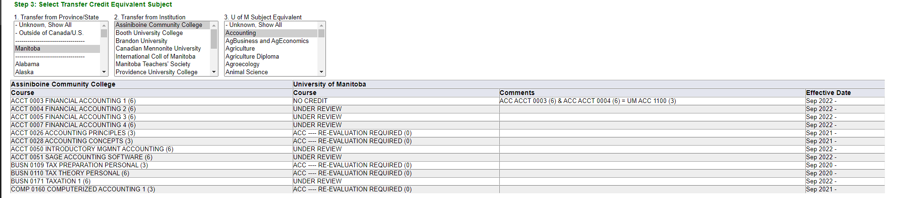
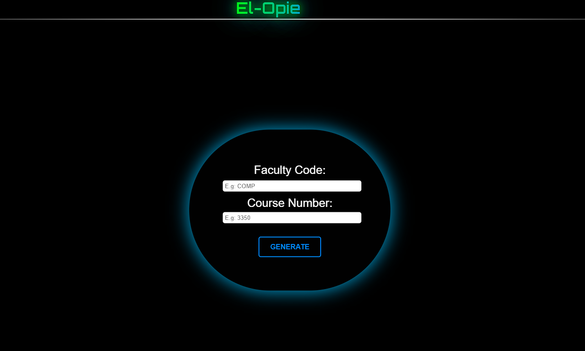
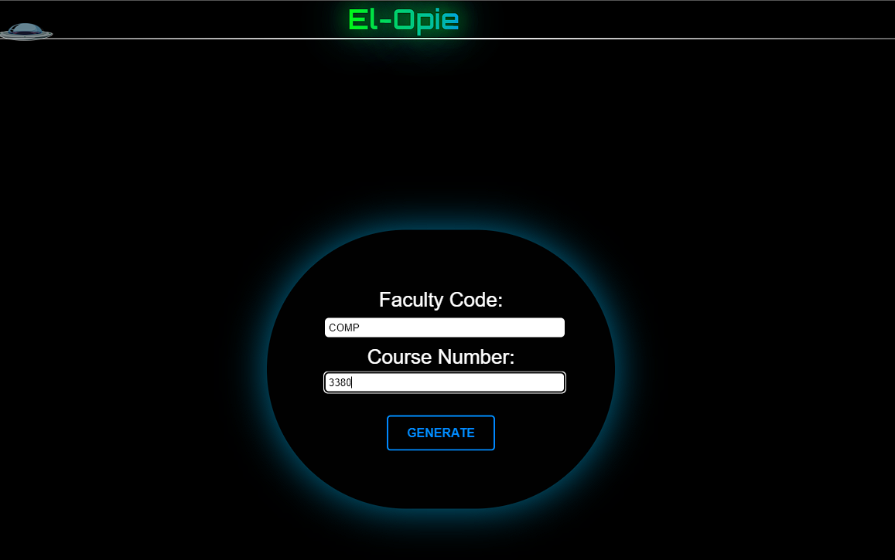
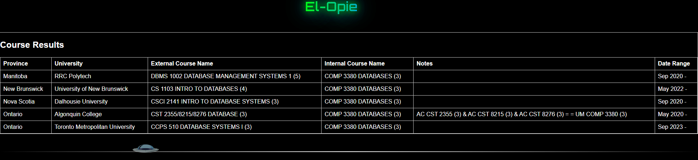
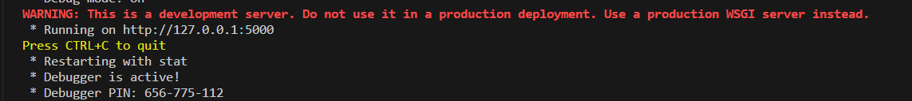

# Welcome to El-Opie
Students have an option to apply for a **Letter of Permission (LOP)** so they can take courses at other universities and transfer the credit.

The current *Transfer Credit Tool* on *Aurora* requires manually sifting through each faculty at each university in each province to find the desired course. This is slow and inefficient.

**El-Opie** offers an alternate interface where users can enter the course code of the desired course and get a list of all approved courses at other universities that can be used for a credit transfer.

## Current System (Aurora)
#### Step 1: Click Province

#### Step 2: Click University

#### Step 3: Click Faculty

#### Step 4: See Results

## El-Opie Interface
#### Step 1: Main Page

#### Step 2: Enter Course Code and Click Generate (Some Lag)

#### Step 3: Results

Use the browser back button to go back and use again.

## Requirements
#### Hardware
This project is to be run on a Windows machine.
#### Software
Firefox is needed for this project. Pip is also needed.
#### Dependencies
`pip install flask` (used by UI)

`pip install pysqlite3` (used by db_connector.py)

The following are only used by `scrape_to_sql.py` and not needed to run the project.

`pip install selenium`

`pip install webdriver-manager`

`pip install pandas`

`pip install unidecode`

## How To Run
After installing dependencies above, simply run `python main.py`

The following will appear in the command line.

`Ctrl + click` on the link provided or copy/paste into a browser to run.

